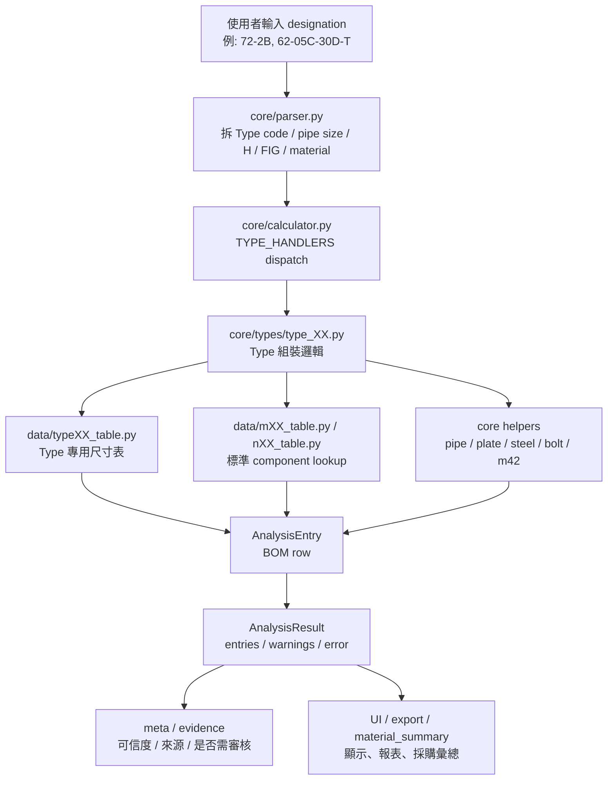
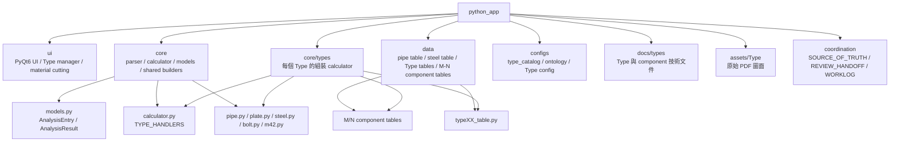
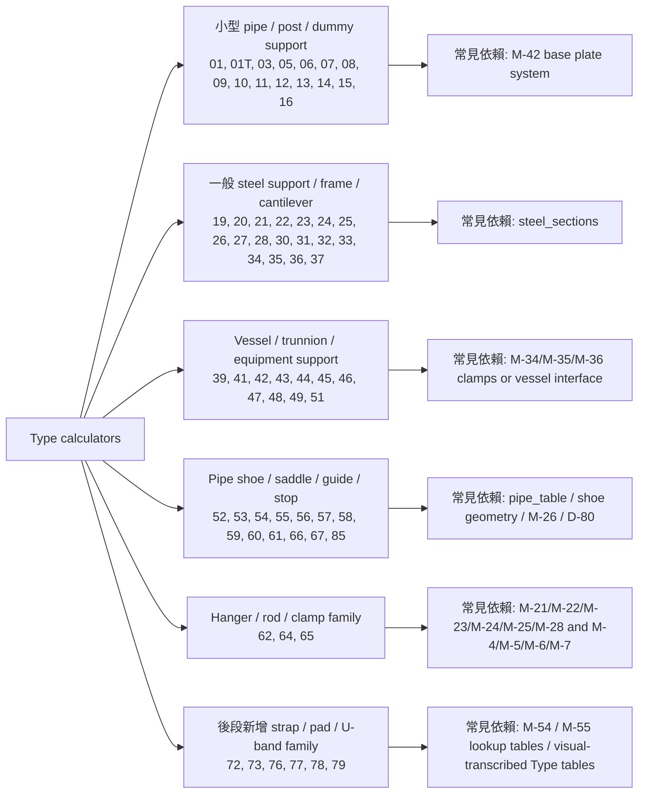
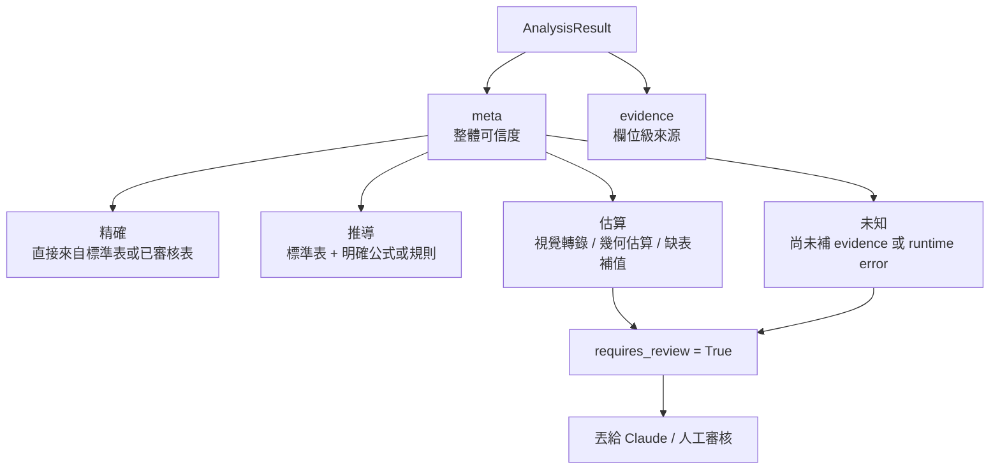
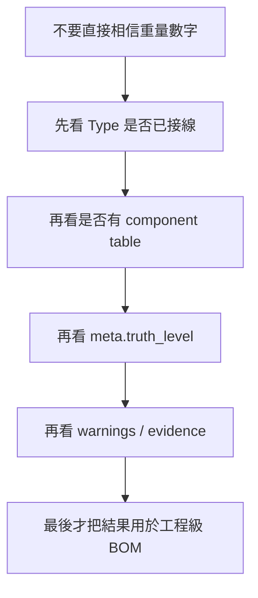

# 專案基底邏輯與 Type 關係樹

建立時間：2026-04-21 14:08 +08:00  
用途：給人類、Codex、Claude 快速理解目前專案的資料流、分層責任、Type 依賴關係與可信度狀態。  
狀態：living map。若 code 與本文件衝突，以 `coordination/SOURCE_OF_TRUTH.md` 的優先順序判定。

---

## 一句話總結

這個專案不是單純的圖片或 catalog viewer，而是 **Pipe Support designation -> Type calculator -> BOM/重量分析 -> 材料彙總/匯出** 的工程資料系統。

最重要的分層原則：

```text
Type = assembly / orchestration layer
M / N = component-level library
data/*.py = lookup table / dimension table
core/*.py = generic part builder and shared rules
```

Type calculator 應該決定「這個支撐型式要哪些零件、數量、限制條件、figure 路徑」。  
M/N table 應該提供「標準零件尺寸、designation、單重或可計重資料」。  
兩者混在一起時，短期可以當 staging，但長期要重構回 component table lookup。

---

## 整體資料流



### 現行資料契約

`AnalysisResult` 目前保留舊契約，並加上新契約：

| 欄位 | 意義 |
|---|---|
| `entries` | BOM 明細，每個 `AnalysisEntry` 是一個零件或材料行 |
| `warnings` | 可以計算但需要注意的工程警告 |
| `error` | 無法計算時的錯誤 |
| `meta` | 整體可信度摘要，例如 `精確`、`推導`、`估算`、`未知` |
| `evidence` | 欄位級來源，例如標準表、公式、PDF 視覺判讀、缺表補值 |

舊 Type 若還沒有補 evidence，系統會保守標為 `未知` 且 `requires_review=True`。這是刻意設計，不代表舊 Type 一定錯，而是代表尚未用新契約審過。

---

## 專案目錄樹



---

## Type 家族視覺樹



---

## Component 依賴樹

```mermaid
flowchart TD
  DATA["data layer"]

  DATA --> BASE["基礎尺寸表"]
  BASE --> PIPE["pipe_table.py<br/>管 OD / thickness / kg per meter"]
  BASE --> STEEL["steel_sections.py<br/>angle / channel / H beam / FB"]
  BASE --> TEE["tee_table.py<br/>ASME tee M dimension"]

  DATA --> M42["M-42 底板系統<br/>m42_table.py + core/m42.py"]
  M42 --> SMALL["常見於 Type 01/03/05/07/08/09/10/11/12/13/22/27/28"]

  DATA --> CLAMP["Clamp / rod / hanger components"]
  CLAMP --> M4["M-4 clamp"]
  CLAMP --> M5["M-5 clamp"]
  CLAMP --> M6["M-6 clamp"]
  CLAMP --> M7["M-7 clamp"]
  CLAMP --> M21["M-21 turnbuckle"]
  CLAMP --> M22["M-22 threaded rod"]
  CLAMP --> M23["M-23 welded eye rod"]
  CLAMP --> M24["M-24 clevis"]
  CLAMP --> M25["M-25 eye nut"]
  CLAMP --> M28["M-28 angle bracket"]

  DATA --> SHOE["Shoe / strap / gasket components"]
  SHOE --> M47["M-47 gasket"]
  SHOE --> M52["M-52 spring wedge"]
  SHOE --> M53["M-53 strap PUBS2"]
  SHOE --> M54["M-54 strap PUBS3"]
  SHOE --> M55["M-55 U-band<br/>missing table, Type 79 still estimated"]

  DATA --> COLD["Cold service N components"]
  COLD --> N1["N-1 to N-28 all have metadata modules"]
  COLD --> NMISS["lookup-ready cold dimensions still pending"]
```



目前 component 覆蓋率以 `data/component_table_registry.py` 與 `docs/COMPONENT_TABLE_STATUS.md` 為準。最近狀態是 71/71 component modules present，其中 19 個 lookup-ready、3 個 partial-lookup、49 個 metadata-only。  
這代表「全部已有可追蹤入口」，不代表全部已可精算；partial-lookup 只能作受限欄位查詢，metadata-only component 仍需逐張 PDF 視覺轉錄後才能升級。

---

## 可信度樹



目前不能把 Type 01 到 Type 79 一口氣全部升級為新契約，原因很簡單：舊 Type 的公式與 table 有些可能是 VBA 搬移、有些可能是工程假設、有些可能只是先用 custom_entry 暫估。  
安全做法是分批補 `evidence`，每批附驗證案例與 reviewer handoff。

---

## 每個已接線 Type 的關係表

說明：

| 標記 | 意義 |
|---|---|
| `舊契約` | 有 calculator，但尚未完整補中文化 `meta/evidence` |
| `新契約` | 已補 `meta/evidence/invariants` |
| `估算` | 含視覺轉錄、幾何估算、缺表補值或未審核重量 |
| `component-backed` | 主要零件已透過 M/N 或 data table lookup |
| `staging` | 可跑，但仍有 component table 待抽離或補全 |

| Type | 家族 | 主要用途 | 主要依賴 | 目前可信度註記 |
|---|---|---|---|---|
| 01 | 小型 pipe support | 假管支撐，elbow 模式 | `configs/type_01.json`, `pipe_table`, `m42_table`, `core/m42.py` | 舊契約，預設 `未知` |
| 01T | 小型 pipe support | 假管支撐，tee 模式 | Type 01 同源，加 `tee_table` | 舊契約，預設 `未知` |
| 03 | 小型 post support | 小管徑彎頭立柱支撐 | `steel_sections`, `core/m42.py` | 舊契約，預設 `未知` |
| 05 | 小型 post support | 小管徑立柱頂托支撐 | `steel_sections`, `core/m42.py` | 舊契約，預設 `未知` |
| 06 | 小型 post support | 雙管托板立柱支撐 | `steel_sections` | 舊契約，預設 `未知` |
| 07 | sliding support | 滑動彎頭支撐 | `type07_table`, `pipe_table`, `m42_table` | 舊契約，預設 `未知` |
| 08 | sliding support | 滑動支撐含 stopper | `type08_table`, `pipe_table`, `steel_sections`, `m42_table` | 舊契約，預設 `未知` |
| 09 | adjustable support | 可調式螺桿支撐 | `type09_table`, `pipe_table`, `m42_table` | 舊契約，預設 `未知` |
| 10 | adjustable support | 可調式四螺栓 dummy pipe support | `type10_table`, `pipe_table`, `plate`, `m42_table` | 舊契約，預設 `未知` |
| 11 | spring support | 彈簧可變載支撐 | `type11_table`, `pipe_table`, `m42_table`, hardware builder | 舊契約，已部分 table lookup |
| 12 | clamp/dummy support | 焊接式雙板夾持支撐 | `type12_table`, `pipe_table`, `plate`, `m42_table` | 舊契約，預設 `未知` |
| 13 | clamp/dummy support | clamp 式雙板夾持支撐 | `type13_table`, `pipe_table`, `M-4`, `M-47`, `m42_table` | 舊契約，部分 component-backed |
| 14 | structural stopper | 結構鋼立柱限位支撐 | `type14_table`, `steel_sections`, `pipe`, `plate` | 舊契約，預設 `未知` |
| 15 | structural stopper | 落在既有鋼構的結構鋼立柱限位 | `type15_table`, `steel_sections`, `pipe`, `plate` | 舊契約，預設 `未知` |
| 16 | guide support | 假管導向支撐含端板 | `pipe_table`, `plate` | 舊契約，預設 `未知` |
| 19 | bracing support | 斜撐式側向支撐 | `type19_table`, `steel_sections` | 舊契約，預設 `未知` |
| 20 | base support | 長孔滑動底座支撐 | `type20_table`, `steel_sections` | 舊契約，預設 `未知` |
| 21 | cantilever support | 側掛式懸臂 U-bolt 支撐 | `type21_table`, `steel_sections` | 舊契約，預設 `未知` |
| 22 | cantilever support | 落地式懸臂 U-bolt 支撐 | `type22_table`, `steel_sections`, `m42_table` | 舊契約，預設 `未知` |
| 23 | cantilever support | 頂掛式懸臂支撐 | `type23_table`, `steel_sections` | 舊契約，預設 `未知` |
| 24 | wall/angle support | 單角鋼貼壁支撐 | `steel_sections` | 舊契約，預設 `未知` |
| 25 | cantilever support | 懸臂式角鋼支撐 | `steel_sections`, `plate`, `custom bolt` | 舊契約，含手寫幾何 |
| 26 | frame support | 標準化懸臂框架支撐 | `steel_sections`, `plate`, `custom bolt` | 舊契約，含手寫幾何 |
| 27 | column support | 立柱式管線支撐 | `steel_sections`, `plate`, `m42_table` | 舊契約，預設 `未知` |
| 28 | portal support | 門型支撐 | `steel_sections`, `m42_table` | 舊契約，預設 `未知` |
| 30 | clamp support | 焊接既有鋼構的夾持型支撐 | `steel_sections` | 舊契約，預設 `未知` |
| 31 | frame support | 既有鋼構上的 frame support | `steel_sections` | 舊契約，catalog 狀態需後續對齊 |
| 32 | hanging frame | 吊掛型框架支撐 | `steel_sections` | 舊契約，預設 `未知` |
| 33 | side-weld frame | 側焊懸臂框架支撐 | `steel_sections` | 舊契約，預設 `未知` |
| 34 | reinforced cantilever | 強化型懸臂梁支撐 | `steel_sections` | 舊契約，預設 `未知` |
| 35 | rail/support strip | 支撐軌道或托條 | `steel_sections` | 舊契約，預設 `未知` |
| 36 | restraint clamp | 夾持固定型支撐，含 bolt/lug plate | `steel_sections`, `plate`, `M-34` | 舊契約，部分 component-backed |
| 37 | braced cantilever | 斜撐懸臂支撐 | `steel_sections` | 舊契約，catalog 狀態需後續對齊 |
| 39 | vessel support | vessel 斜撐支撐 | `type39_table`, `steel_sections`, `plate`, `M-34/M-35/M-36` | 舊契約，部分 component-backed |
| 41 | wall anchor | 牆面錨定支撐 | `type41_table`, `plate`, `M-45` | 舊契約，部分 component-backed |
| 42 | vessel/trunnion | trunnion 曲面設備斜撐 | `type42_table`, `steel_sections`, `plate`, pipe-like geometry | 舊契約，預設 `未知` |
| 43 | vessel/trunnion | trunnion 曲面設備全約束 | `type43_table`, `steel_sections`, `plate`, `M-34/M-35/M-36` | 舊契約，部分 component-backed |
| 44 | vessel support | 曲面設備直接斜撐 | `type44_table`, `steel_sections`, `plate` | 舊契約，預設 `未知` |
| 45 | vessel clamp | 曲面設備直接夾持 | `type45_table`, `steel_sections`, `plate`, `M-34/M-35/M-36` | 舊契約，部分 component-backed |
| 46 | vessel D-80 interface | 曲面設備直接支撐含 D-80 接口 | `type46_table`, `steel_sections`, `plate` | 舊契約，D-80 介面需注意 |
| 47 | vessel D-80 clamp | 曲面設備直接夾持含 D-80 接口 | `type46_table`, `steel_sections`, `plate`, `M-34/M-35/M-36` | 舊契約，D-80 介面需注意 |
| 48 | drain hub | drain hub 偏移底座支撐 | `type48_table`, `plate` | 舊契約，預設 `未知` |
| 49 | riser support | 立管固定支撐 | `M-11/M-12/M-41` reference, currently custom estimate | 舊契約，staging |
| 51 | saddle support | 管線鞍座承托支撐 | `type51_table`, `steel_sections`, `plate` | 舊契約，預設 `未知` |
| 52 | pipe shoe | 帶側限位的 shoe 承托支撐 | shared `type_52.py`, `pipe_table`, `steel_sections`, `plate` | 舊契約，shared handler |
| 53 | pipe shoe | guided pipe shoe support | shared `type_52.py`, `pipe_table`, `steel_sections`, `plate` | 舊契約，shared handler |
| 54 | pipe shoe | isolated clamp shoe support | shared `type_52.py`, `pipe_table`, `steel_sections`, `plate` | 舊契約，shared handler |
| 55 | pipe shoe | guided clamped shoe with gasket isolation | shared `type_52.py`, `pipe_table`, `steel_sections`, `plate` | 舊契約，shared handler |
| 56 | pipe stop | 結構式管線檔止 | `type56_table`, `pipe_table`, `steel_sections`, `plate` | 舊契約，預設 `未知` |
| 57 | U-bolt support | U-bolt on existing steel | `type57_table`, references `M-26` | 舊契約，M-26 reference but local custom rows |
| 58 | U-bolt plate saddle | U-bolt plate saddle on steel plate / shape steel | `type58_table`, plate, references `M-26` | 舊契約，M-26 尚未完全接線 |
| 59 | lug plate support | shoe / bare pipe lug plate support | `type59_table`, plate, custom bolt | 舊契約，Claude 已修正 plate qty / SS thickness |
| 60 | large bore shoe side | large bore shoe side support | `type60_table`, plate, D-80/TYPE-66 warning | 舊契約，shoe not furnished |
| 61 | trunnion support | trunnion 支座設計 | `pipe_table`, plate, custom entries | 舊契約，幾何需審核 |
| 62 | hanger combination | pipe hanger combination | `type62_table`, `M-21/M-22/M-24/M-25/M-28`, `M-4/M-5/M-6/M-7`, metadata-only `M-3/M-8/M-9/M-10/M-31/M-33` | 舊契約，但已 Claude approve；部分 lower components 仍非 lookup-ready |
| 64 | rod hanger | pipe-to-pipe rod hanger | `type64_table`, `M-22`, `M-25`, `M-4/M-6` | 舊契約，部分 component-backed |
| 65 | trapeze hanger | trapeze hanger with cross member | `type65_table`, `M-23`, `M-28`, round bar estimate | 舊契約，1 1/8 fallback 與 stiffener estimate 已標 caveat |
| 66 | pipe shoe | pipe shoe / saddle interface | shared `type_52.py`, `pipe_table`, `steel_sections`, `plate` | 舊契約，shared handler |
| 67 | pipe shoe | clamped pipe shoe with gasket isolation | shared `type_52.py`, `pipe_table`, `steel_sections`, `plate` | 舊契約，shared handler |
| 72 | strap support | strap support, D-87 | `type72_table`, `M-54 Fig.2`, `M-45` | 新契約，`估算`，M-45 weight fallback |
| 73 | spring strap | spring strap support, D-88/D-88A | `type73_table`, D-88 visual table, spring table, references `M-53` designation | 新契約，`估算`，需未來與 M-53 交叉確認 |
| 76 | pad support | large-pipe 120 degree pad support | `type76_table`, pipe OD formula | 新契約，`估算`，公式清楚但 source 來自 visual |
| 77 | saddle support | large-pipe saddle support | `type77_table`, bounding rectangle weight estimate | 新契約，`估算` |
| 78 | strap anchor | small-pipe strap anchor/support | `M-54 Fig.1` | 新契約，`估算`，M-54 visual transcription |
| 79 | U-band support | U-band support | lookup-ready `M-55`, `type79_table` regression reference | 新契約，`估算`，M-55 已接線但重量仍是 B×E×T 幾何估算 |
| 85 | pipe shoe | shared shoe calculator path | shared `type_52.py`, `pipe_table`, `steel_sections`, `plate` | 舊契約，shared handler |

---

## 尚未接線或只在 catalog 內的 Type

`TYPE_HANDLERS` 沒有接到的 Type，不應被視為可計算。

| 類別 | 例子 | 狀態 |
|---|---|---|
| 一般缺號或未建 calculator | 02, 04, 17, 18, 29, 38, 40, 50, 63, 68, 69, 70, 71, 74, 75 | 目前沒有 `core/types/type_XX.py` calculator |
| catalog placeholder | 80, 81, 82, 83, 84, 86, 87, 101+ | catalog 可見，但不是已驗證 calculator |
| cold support Type | 01C, 02C, 03C 等 | 多數仍依賴 N-series metadata 或 placeholder |
| special | CA, G1, G2, PO1, PO2, PO3, SPS-* | catalog placeholder 或特殊件，非一般 Type calculator |

---

## 目前最需要穩住的核心邏輯



實務判斷順序：

| 問題 | 判斷方式 |
|---|---|
| 這個 Type 能不能跑？ | 看 `calculator.TYPE_HANDLERS` 是否有接線 |
| 這個 Type 是不是可信？ | 看 `AnalysisResult.meta.truth_level` |
| 重量是精算還估算？ | 看 `evidence.basis` 是否有 `geometry_estimate`, `visual_transcription`, `missing_table` |
| 哪些零件還缺表？ | 看 `component_table_registry.py` 與 warnings |
| Claude 要審哪裡？ | 看 `coordination/REVIEW_HANDOFF.md` |

---

## 對後續開發的建議路線

優先順序應該是：

1. 先補 component table，尤其是被多個 Type 共用的 M/N。
2. 再把 Type 裡的 custom estimate 改成 table lookup。
3. 每次只做單向接線，不改既有業務公式。
4. 每批補 `meta/evidence`，不要一次替全部舊 Type 背書。
5. 每批都跑 `validate_tables.py`，並更新 `REVIEW_HANDOFF.md` 與 `WORKLOG.md`。

目前最不該做的是：把 Type 01 到 Type 79 全部直接標為 `精確` 或 `推導`。那會讓歷史估算被誤認成工程級精算，反而污染專案可信度。

---

## Reviewer 快速審核點

請 Claude 或人工 reviewer 優先確認：

| 審核點 | 為什麼重要 |
|---|---|
| Type family 分組是否符合工程理解 | 這會影響後續 batch 開發切分 |
| Type relation table 是否有錯誤依賴 | 這會影響 component table 優先順序 |
| `舊契約 -> 未知` 的保守策略是否接受 | 這是避免過度信任舊公式的安全閥 |
| Type 72/73/76/77/78/79 的 `估算` 標記是否足夠明確 | 這些最近新增且依賴 visual transcription |
| catalog status 與 calculator 接線是否需要另批對齊 | 例如 31/36/37/39 等 catalog status 仍可能是 documented |
